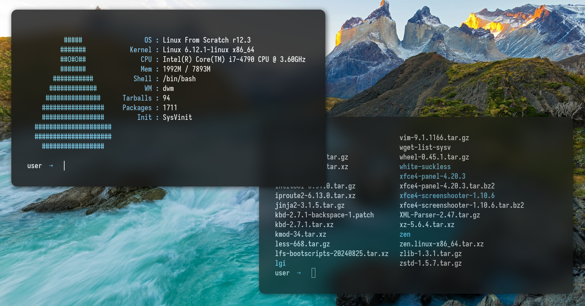

  <h1>🌟 <strong>𝗟𝗙𝗦-𝗙𝗘𝗧𝗖𝗛</strong> 🌟</h1>

  <h2>🎨 Showcase</h2>
  

    Below is a preview of my fetch programm wich can be used for Linux From Scratch or can be modified for specifiec needs.
  

  

---

  

    My Distro of choice is <strong>LFS (Linux From Scratch) </strong>,
    prioritizing <strong>performance</strong>, <strong>simplicity</strong>, and a <strong>clean aesthetic</strong>.
  

  

    <a href="https://www.linuxfromscratch.org/lfs/view/stable/" target="_blank" style="text-decoration: none; color: inherit;">
      LFS 12.2 Book
    </a>
  

  

---
