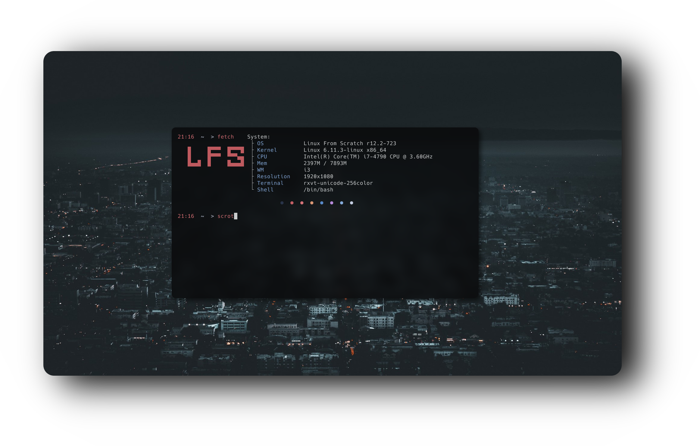

  <h1>🐧 <strong>𝗟𝗙𝗦-𝗙𝗘𝗧𝗖𝗛</strong> 🐧</h1>

  <h2 style="font-size: 24px;">
    <strong> <a href="https://www.linuxfromscratch.org/" style="text-decoration: none; color: inherit;">
      
      Linux From Scratch</a> 
    </strong>
  </h2>

  <h2>🎨 Showcase</h2>
  

    Below is a preview of my fetch programm wich can be used for Linux From Scratch or can be modified for specifiec needs.
  

  

---
